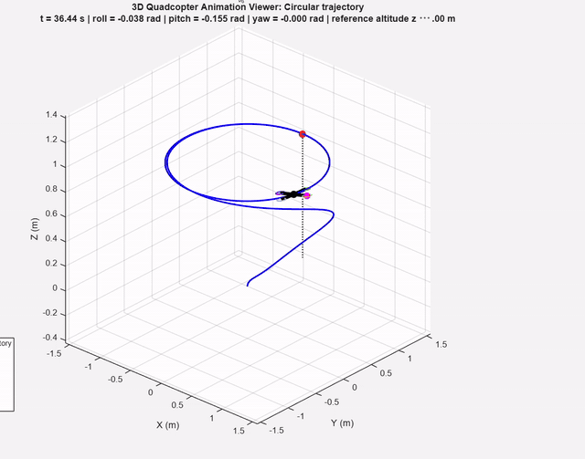
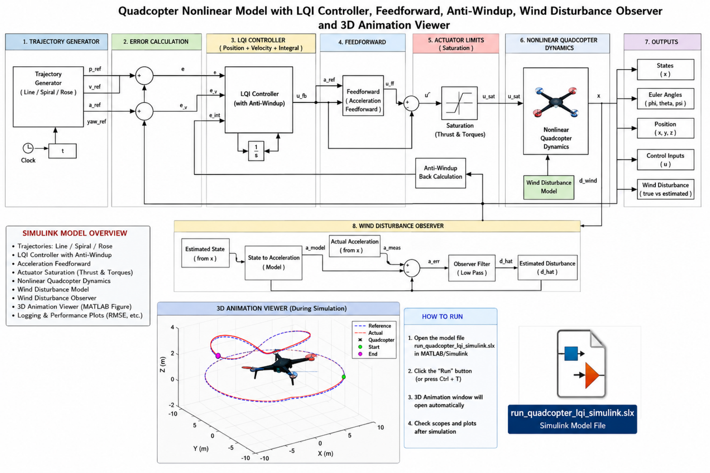
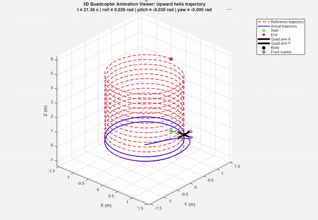
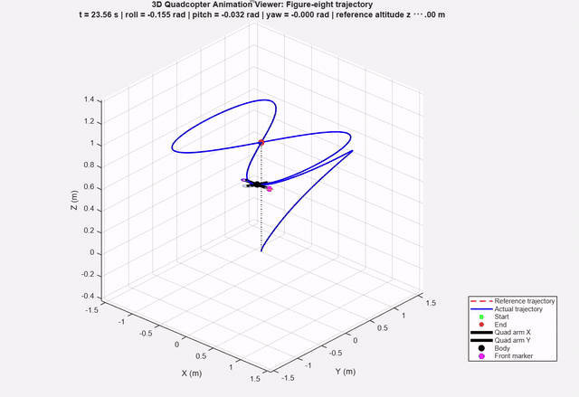

# LQI Control for Quadrotor Trajectory Tracking

MATLAB and Simulink implementation of a Linear Quadratic Integral controller for quadrotor trajectory tracking, running against a **nonlinear** quadrotor plant with acceleration feedforward, integral anti-windup, a wind disturbance observer, and four external torque-disturbance modes injected into the rotational dynamics only.

The LQI gains are computed from a genetically optimized cost vector by solving the continuous algebraic Riccati equation through the stable invariant subspace of the Hamiltonian matrix — so **no Control System Toolbox is required**. `lqi`, `lqr`, `care` and `ss` are never called.

Part of a controller benchmark series (LQI · GA-LQI · MPC · GA-PID · NFSSMC) built on an identical plant, identical reference trajectories and identical disturbance profiles, so results are directly comparable across controllers. Companion repository: [ga-mpc-quadrotor](https://github.com/MuaazAero/ga-mpc-quadrotor).



## Architecture



Full-resolution vector version: [block_diagram_LQI.pdf`](docs/block_diagram_LQI.pdf)

## Controller

| | |
|---|---|
| Control law | `U = U_ff − Kx·e − Ki·∫e_pos dt` |
| Plant | Nonlinear 12-state quadrotor, RK4 integration (linear hover model selectable) |
| Design model | Hover-linearized about ψ = 0, augmented with 3 integral states on x, y, z |
| Riccati solver | Hamiltonian invariant subspace, toolbox-free |
| Cost weights | 19-element GA-optimized vector — 15 state/integral weights, 4 input weights |
| Feedforward | Reference acceleration mapped to thrust and roll/pitch commands, tilt-limited to 20° |
| Anti-windup | Integral clamping plus conditional integration — the integral update is accepted only if it does not increase actuator saturation |
| Disturbance observer | Low-pass estimate of horizontal wind acceleration from measured minus model-predicted acceleration; never reads the true wind signal |

### Platform

Mass 1.25 kg · Ixx = Iyy = 0.0232 kg·m² · Izz = 0.0468 kg·m²
Thrust ∈ [0, 25] N · body torques ∈ [−7, 7] N·m per axis

State `x = [x ẋ y ẏ z ż φ φ̇ θ θ̇ ψ ψ̇]`, input `U = [T τφ τθ τψ]`.

## Reference trajectories

Selected by a single flag (`slctr`):

| | Trajectory | Geometry |
|---|---|---|
| 1 | Circular | R = 1 m, constant altitude 1 m |
| 2 | Upward helix | R = 1 m, climbing 0 → 5 m |
| 3 | Figure-eight | R = 1 m, constant altitude 1 m |
| 4 | Upward spiral | R = 5 m, 0.75 m/s climb |
| 5 | Rose-petal | R = 5 m, k = 2, vertical oscillation |

By default the quadrotor starts on the ground at the origin, so the initial climb onto a constant-altitude path is visible in the tracking plots rather than hidden by a perfect initial condition.

## Disturbances

**Torque disturbance** (`torqueDistMode`) — applied to roll, pitch and yaw only, never to translational acceleration, and never revealed to the controller:

| Mode | Peak amplitude |
|---|---|
| 1 | none |
| 2 | 0.15 N·m |
| 3 | 0.30 N·m |
| 4 | 0.50 N·m |

**Wind** (`enableWind`) — optional stochastic horizontal wind acting on ẍ and ÿ through a quadratic drag model (Cd = 0.75, A = 0.1 m², ρ = 1.225 kg/m³). Enable the observer alongside it with `enableWindObserver`.

## Animations





Full-length recordings: [`media/`](media)

## Running it

```matlab
cd src
lqi_03_Final
```

Set the trajectory and disturbance at the top of the file:

```matlab
slctr          = 5;   % 1 circle · 2 helix · 3 figure-eight · 4 spiral · 5 rose-petal
torqueDistMode = 1;   % 1 none · 2 weak 0.15 · 3 medium 0.30 · 4 strong 0.50 N·m
TfinalUser     = 150; % simulation duration, seconds
```

Results open in a single window with 15 tabs — position and attitude tracking, per-axis errors, 3D and top views, RMSE and ITAE tables, steady-state summaries, torque disturbance history, states, control inputs, integral error, and a live 3D quadrotor animation.

### Exporting results

```matlab
save_all_figures_to_pdf          % every tab becomes one page of a single PDF
export_lqi_tables_to_word        % RMSE / ITAE / steady-state tables to .docx
```

`save_all_figures_to_pdf` writes to an `LQI_Results` folder created beside the script. `export_lqi_tables_to_word` uses Word ActiveX and therefore needs Windows with Microsoft Word installed.

### Simulink model

`simulink/LQI_Quadcopter_Model.slx` is the **linear** counterpart of the MATLAB implementation — a state-space plant with the same LQI gains, integral action and thrust saturation. It has no nonlinear dynamics, feedforward, wind observer or torque disturbance; for those, use the MATLAB script.

Its blocks reference workspace variables by name, so run the setup script first:

```matlab
cd simulink
setup_simulink_model
open('LQI_Quadcopter_Model.slx')   % then press Run
```

## Requirements

- MATLAB R2020b or newer (developed on R2025b)
- Simulink — only for the `.slx` model
- **No Control System Toolbox needed** — the Riccati equation is solved directly
- Microsoft Word on Windows — only for `export_lqi_tables_to_word`

## Repository layout

```
src/         MATLAB implementation, PDF figure export, Word table export
simulink/    Linear Simulink model and its workspace setup script
docs/        Block diagram (PDF + PNG), README images and animations
media/       Full-length animation recordings
```

## Known limitations

- The LQI gain is linearized about ψ = 0. `yawMode = 'path'` makes yaw follow the path heading, but with the same hover gain the nonlinear plant can over-rotate and lose vertical lift, so `'constant'` is the stable default.
- The Simulink model integrates all 12 error channels while integral action is meaningful only on x, y and z. `setup_simulink_model` zeroes the corresponding gain columns, so the nine unused integrator states are inert and do not affect the control signal.
- The wind observer should be enabled only together with wind; running it with `enableWind = false` estimates noise.

## Author

**Sheikh Muaaz** — B.Sc. Aerospace Engineering, Aviation & Aerospace University Bangladesh.
First-author paper on adaptive fuzzy gain-scheduled NFSSMC for quadrotor trajectory tracking accepted at PEEIACON 2026.

sheikhmuaaz06@gmail.com · [github.com/MuaazAero](https://github.com/MuaazAero)

## License

MIT — see [LICENSE](LICENSE).
